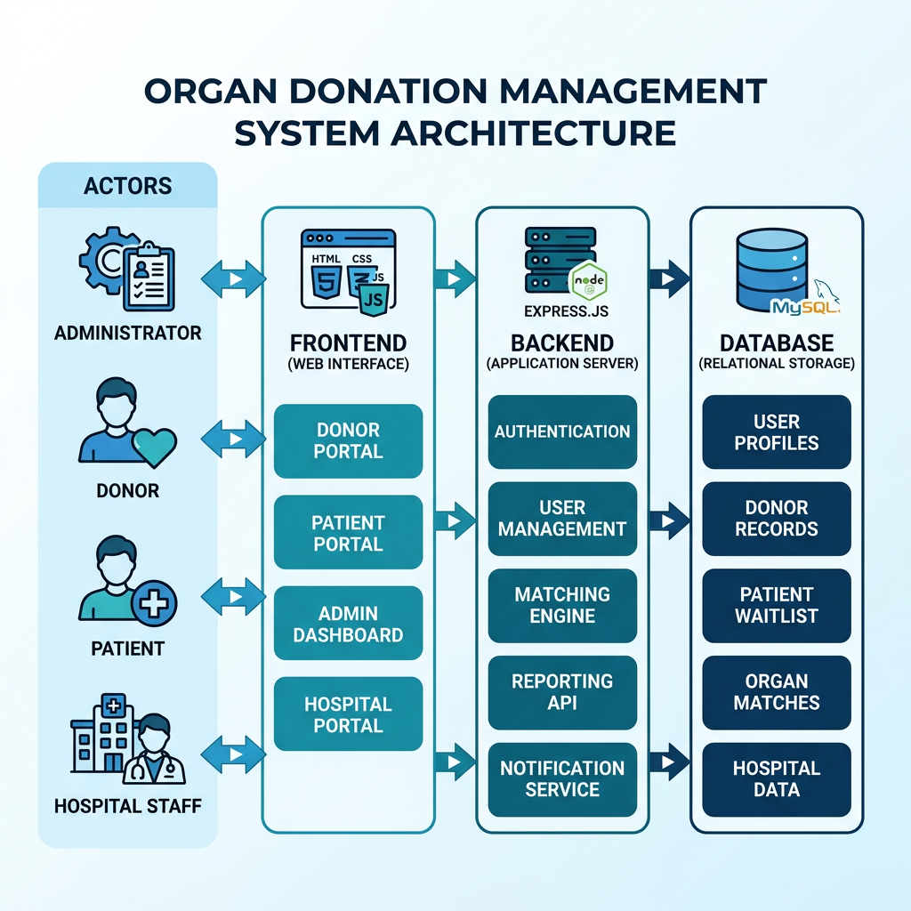

# Organ Donation Management System
## Project Report

**Submitted by:** [Your Name]  
**Course:** B.Sc / B.Tech Computer Science  
**Year:** Final Year  
**Academic Year:** 2025–2026  
**College:** [Your College Name]  

---

## Table of Contents

1. Abstract  
2. Introduction  
3. Problem Statement  
4. Objectives of the System  
5. System Architecture  
6. Modules Description  
7. Database Design  
8. Technologies Used  
9. Advantages of the System  
10. Future Enhancements  
11. Conclusion  

---

## 1. Abstract

The Organ Donation Management System is a web-based application developed to bridge the gap between organ donors, patients in need, and hospitals that manage the transplantation process. The system provides a centralized digital platform where donors can register and pledge organs, patients can submit organ requests, and hospitals can verify and manage the entire transplant workflow. An intelligent matching algorithm based on blood group compatibility and organ type connects donors with patients efficiently. The system is built using Node.js with Express for the backend, MySQL for data storage, and HTML/CSS/JavaScript for the frontend. Role-based authentication ensures that only authorized users can access restricted features, making the system secure and reliable.

---

## 2. Introduction

Organ donation is one of the most impactful acts of generosity, saving thousands of lives each year. However, the process of matching organ donors with patients remains largely manual, fragmented, and time-consuming. Hospitals, donors, and patients often lack a unified platform to communicate and coordinate, leading to delays that can cost lives.

This project aims to solve this problem by creating a web-based Organ Donation Management System. The system digitizes the entire organ donation workflow — from donor registration to patient organ requests to hospital verification and finally to intelligent donor-patient matching.

The system supports four types of users:
- **Admin** — Manages the entire system, approves registrations, and oversees operations.
- **Donor** — Registers and pledges organs for donation.
- **Patient** — Registers and submits requests for needed organs.
- **Hospital** — Verifies donor/patient details and manages the transplant process.

Six types of organs are supported: Kidney, Liver, Heart, Lungs, Eyes, and Pancreas.

---

## 3. Problem Statement

Currently, there is no centralized system that connects organ donors with patients who need transplantation in an efficient, automated manner. The existing process involves:

- **Manual record-keeping** — Donor and patient data is maintained in physical registers or disconnected spreadsheets.
- **No automated matching** — Finding a compatible donor for a patient requires manual searching through records, which is slow and error-prone.
- **Lack of verification** — There is no standardized digital process for hospitals to verify donor eligibility.
- **Communication gaps** — Donors, patients, and hospitals operate in silos without a common platform.
- **Time sensitivity** — Organ transplantation is highly time-sensitive, and any delay in finding a match can be fatal.

There is a critical need for a web-based system that automates donor-patient matching, provides role-based access, and gives hospitals the tools to manage the transplantation process efficiently.

---

## 4. Objectives of the System

1. Develop a web-based platform that connects organ donors, patients, and hospitals.
2. Implement a secure user registration and authentication system with role-based access control.
3. Allow donors to register and pledge specific organs for donation.
4. Allow patients to submit organ requests specifying the organ needed and urgency level.
5. Enable hospitals to register, get verified, and manage donor/patient records.
6. Implement an intelligent organ matching algorithm based on blood group compatibility and organ type.
7. Provide an admin dashboard for system-wide management, statistics, and oversight.
8. Ensure data security through password hashing, JWT authentication, and parameterized SQL queries.

---

## 5. System Architecture



The system follows a **three-tier client-server architecture**:

```
┌─────────────────────────────────────────────────────────────┐
│                        USERS                                │
│   👑 Admin    🩸 Donor    🏥 Patient    🏢 Hospital          │
└──────────────────────┬──────────────────────────────────────┘
                       │ HTTP Requests
                       ▼
┌─────────────────────────────────────────────────────────────┐
│              FRONTEND (Presentation Layer)                   │
│          HTML5 + CSS3 + Vanilla JavaScript                   │
│                                                             │
│  ┌──────────┐ ┌──────────┐ ┌──────────┐ ┌──────────┐       │
│  │  Home    │ │  Login   │ │ Register │ │Dashboard │       │
│  │  Page    │ │  Page    │ │   Page   │ │  Pages   │       │
│  └──────────┘ └──────────┘ └──────────┘ └──────────┘       │
│  ┌──────────┐ ┌──────────┐                                  │
│  │  Donor   │ │ Matching │                                  │
│  │  List    │ │ Results  │                                  │
│  └──────────┘ └──────────┘                                  │
└──────────────────────┬──────────────────────────────────────┘
                       │ REST API Calls (JSON)
                       ▼
┌─────────────────────────────────────────────────────────────┐
│              BACKEND (Application Layer)                     │
│            Node.js + Express.js Framework                    │
│                                                             │
│  ┌────────────────────────────────────────────────────┐     │
│  │              JWT Authentication Middleware          │     │
│  └────────────────────────────────────────────────────┘     │
│  ┌──────────┐ ┌──────────┐ ┌──────────┐ ┌──────────┐       │
│  │  Auth    │ │  Donor   │ │ Patient  │ │ Hospital │       │
│  │  Routes  │ │  Routes  │ │  Routes  │ │  Routes  │       │
│  └──────────┘ └──────────┘ └──────────┘ └──────────┘       │
│  ┌──────────┐ ┌──────────┐                                  │
│  │  Match   │ │  Admin   │                                  │
│  │  Routes  │ │  Routes  │                                  │
│  └──────────┘ └──────────┘                                  │
└──────────────────────┬──────────────────────────────────────┘
                       │ SQL Queries (mysql2)
                       ▼
┌─────────────────────────────────────────────────────────────┐
│               DATABASE (Data Layer)                          │
│                    MySQL 8.0+                                │
│                                                             │
│  ┌──────────┐ ┌──────────┐ ┌──────────┐                     │
│  │  users   │ │  donors  │ │ patients │                     │
│  └──────────┘ └──────────┘ └──────────┘                     │
│  ┌──────────┐ ┌──────────────┐ ┌──────────┐                 │
│  │hospitals │ │organ_requests│ │ matches  │                 │
│  └──────────┘ └──────────────┘ └──────────┘                 │
└─────────────────────────────────────────────────────────────┘
```

**Data Flow:**
1. Users interact with the frontend (HTML/CSS/JS) through a web browser.
2. The frontend makes REST API calls to the backend using `fetch()`.
3. The Express.js backend processes requests, applies JWT authentication, and queries MySQL.
4. MySQL stores all persistent data and returns query results.
5. The backend sends JSON responses back to the frontend for display.

---

## 6. Modules Description

### 6.1 Authentication Module
This module handles user registration and login for all four roles (Admin, Donor, Patient, Hospital). User passwords are hashed using bcrypt before storage. On successful login, a JSON Web Token (JWT) is generated and stored in the browser's localStorage for subsequent authenticated requests. Each API endpoint is protected by middleware that verifies the JWT and checks the user's role.

**Key Features:**
- Registration with email, name, password, and role selection
- Login with email and password
- JWT token generation (24-hour expiry)
- Role-based access control middleware

### 6.2 Donor Registration Module
Donors can register in the system by providing personal details including blood group, organ to donate, age, gender, phone number, and city. Once registered, the donor profile is set to "pending" status and requires approval from an admin or verified hospital before appearing in the public donor list.

**Key Features:**
- Donor profile creation with blood group and organ selection
- Support for 6 organ types: Kidney, Liver, Heart, Lungs, Eyes, Pancreas
- Support for 8 blood groups: A+, A-, B+, B-, AB+, AB-, O+, O-
- Admin/Hospital approval workflow
- Filterable donor list (by blood group, organ, city)

### 6.3 Patient Organ Request Module
Patients register with their medical details and can submit formal organ requests. Each request specifies the organ needed, blood group, and urgency level (low, medium, high, critical). These requests enter a queue that the matching algorithm processes to find compatible donors.

**Key Features:**
- Patient profile creation with medical details
- Organ request submission with urgency levels
- Request status tracking (pending → matched → completed)
- Request history view

### 6.4 Hospital Verification Module
Hospitals register with their official name, license number, contact details, and address. Hospital accounts require admin approval before they can participate in the system. Once approved, hospitals can verify donor profiles and manage organ requests.

**Key Features:**
- Hospital registration with license verification
- Admin approval workflow
- Donor profile verification capability
- Organ request management

### 6.5 Organ Matching Algorithm Module
This is the core intelligence of the system. When triggered (by an admin or hospital), the algorithm takes an open organ request and searches for compatible donors based on:

1. **Organ type match** — Donor's pledged organ must match the patient's requested organ.
2. **Blood group compatibility** — Uses a medical blood group compatibility table:

| Patient Blood Group | Compatible Donor Blood Groups |
|---------------------|-------------------------------|
| O-                  | O-                            |
| O+                  | O-, O+                        |
| A-                  | O-, A-                        |
| A+                  | O-, O+, A-, A+                |
| B-                  | O-, B-                        |
| B+                  | O-, O+, B-, B+                |
| AB-                 | O-, A-, B-, AB-               |
| AB+                 | All blood groups              |

3. **Compatibility scoring:**
   - 100% = Exact blood group match
   - 75% = Compatible but different blood group
   - 0% = Incompatible (excluded)

The algorithm returns a ranked list of matching donors sorted by compatibility score.

### 6.6 Admin Dashboard Module
The admin has full control over the system. The dashboard displays key statistics (total users, donors, patients, hospitals, organ requests, matches) and provides management tools for user accounts, pending approvals, and the ability to trigger the matching algorithm.

**Key Features:**
- Real-time statistics dashboard (8 key metrics)
- User management (view, filter by role, delete)
- Pending donor and hospital approval management
- One-click matching algorithm execution

---

## 7. Database Design

The system uses a MySQL relational database with 6 tables:

### Entity-Relationship Summary

```
users ──────┬──── donors
            ├──── patients ──── organ_requests ──── matches
            └──── hospitals
```

### Table Structures

**1. users** — Stores all user accounts
| Column | Type | Description |
|--------|------|-------------|
| id | INT (PK) | Auto-increment primary key |
| name | VARCHAR(100) | User's full name |
| email | VARCHAR(100) | Unique email address |
| password | VARCHAR(255) | bcrypt-hashed password |
| role | ENUM | admin, donor, patient, hospital |
| created_at | TIMESTAMP | Account creation time |

**2. donors** — Stores donor profiles
| Column | Type | Description |
|--------|------|-------------|
| id | INT (PK) | Auto-increment primary key |
| user_id | INT (FK) | References users.id |
| blood_group | VARCHAR(5) | Blood group (A+, B-, etc.) |
| organ | VARCHAR(50) | Organ pledged for donation |
| age | INT | Donor's age |
| gender | VARCHAR(10) | Male/Female/Other |
| phone | VARCHAR(20) | Contact number |
| city | VARCHAR(100) | City of residence |
| medical_history | TEXT | Optional medical notes |
| status | ENUM | pending, approved, rejected |

**3. patients** — Stores patient profiles (similar structure to donors with organ_needed and urgency fields)

**4. hospitals** — Stores hospital registrations (includes hospital_name, license_no, address, verification_status)

**5. organ_requests** — Formal organ requests submitted by patients (links to patient, specifies organ and urgency)

**6. matches** — Stores matching results (links donor_id, patient_id, request_id, compatibility_score, status)

---

## 8. Technologies Used

| Component | Technology | Purpose |
|-----------|-----------|---------|
| Frontend | HTML5 | Page structure and content |
| Frontend | CSS3 | Styling with dark theme, glassmorphism |
| Frontend | JavaScript (Vanilla) | Client-side logic, API calls |
| Backend | Node.js | Server-side JavaScript runtime |
| Backend | Express.js | Web application framework |
| Database | MySQL | Relational data storage |
| Authentication | JWT (jsonwebtoken) | Stateless session management |
| Security | bcryptjs | Password hashing |
| API | RESTful | Client-server communication |
| Environment | dotenv | Configuration management |
| CORS | cors | Cross-origin request handling |
| IDE | VS Code | Code editor |

---

## 9. Advantages of the System

1. **Centralized Platform** — Brings donors, patients, and hospitals together on one platform, eliminating the need for manual coordination.

2. **Automated Matching** — The blood group compatibility algorithm automatically finds suitable donors for patients, reducing human error and saving time.

3. **Role-Based Security** — Each user type has restricted access to only their relevant features, ensuring data privacy and system security.

4. **Real-Time Management** — Admin and hospital staff can view real-time statistics, manage pending approvals, and trigger matching instantly.

5. **Scalable Architecture** — The three-tier architecture (Frontend → Backend → Database) allows each layer to be scaled independently.

6. **Data Security** — Passwords are hashed with bcrypt, API routes are protected with JWT tokens, and all database queries use parameterized inputs to prevent SQL injection.

7. **User-Friendly Interface** — Modern, responsive design with intuitive navigation makes the system accessible to users of all technical levels.

8. **Time-Sensitive Handling** — Urgency levels in organ requests allow the system to prioritize critical cases.

---

## 10. Future Enhancements

1. **Email/SMS Notifications** — Notify donors and patients via email or SMS when a match is found.

2. **Real-Time Chat** — Allow hospitals to communicate with donors and patients directly through the platform.

3. **Geolocation-Based Matching** — Factor in geographic proximity when matching donors with patients for faster transplantation.

4. **Medical Report Upload** — Allow users to upload medical documents and test reports.

5. **Multi-Organ Donation** — Allow donors to pledge multiple organs in a single registration.

6. **Analytics Dashboard** — Add charts and graphs to the admin dashboard for data visualization.

7. **Mobile Application** — Develop Android/iOS apps for better accessibility.

8. **Government Integration** — Connect with national organ donation registries for broader matching.

9. **AI-Based Matching** — Use machine learning to improve matching accuracy based on historical success rates.

10. **Cloud Deployment** — Deploy on AWS/GCP/Azure for global accessibility and high availability.

---

## 11. Conclusion

The Organ Donation Management System successfully demonstrates a web-based solution for managing the organ donation lifecycle. The system connects donors, patients, and hospitals through a centralized platform with intelligent matching capabilities.

Key achievements of this project include:
- A complete full-stack web application with secure authentication
- An intelligent organ matching algorithm based on medical blood group compatibility
- Role-based access control for four distinct user types
- A modern, responsive user interface with professional design
- Comprehensive admin tools for system management and oversight

This project serves as a proof of concept for how technology can be leveraged to make organ donation more accessible, efficient, and organized. With future enhancements such as mobile apps, real-time notifications, and government registry integration, this system has the potential to make a real impact in saving lives.

---

## References

1. Node.js Official Documentation — https://nodejs.org/docs
2. Express.js Official Documentation — https://expressjs.com
3. MySQL Documentation — https://dev.mysql.com/doc
4. JSON Web Token (JWT) — https://jwt.io
5. bcrypt.js — https://www.npmjs.com/package/bcryptjs
6. Blood Group Compatibility Chart — National Health Service (NHS)

---

*End of Project Report*
